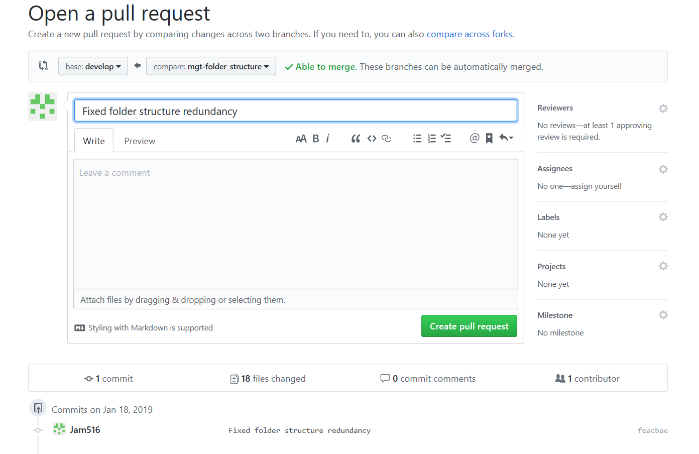
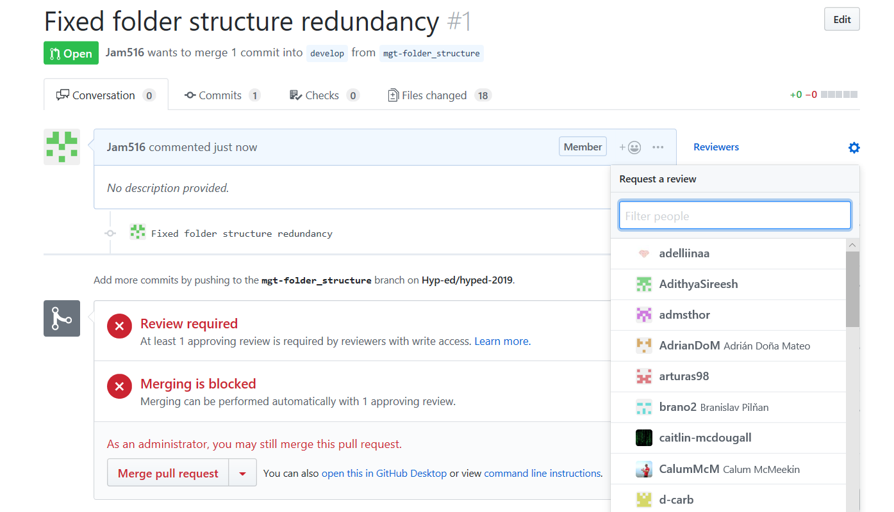
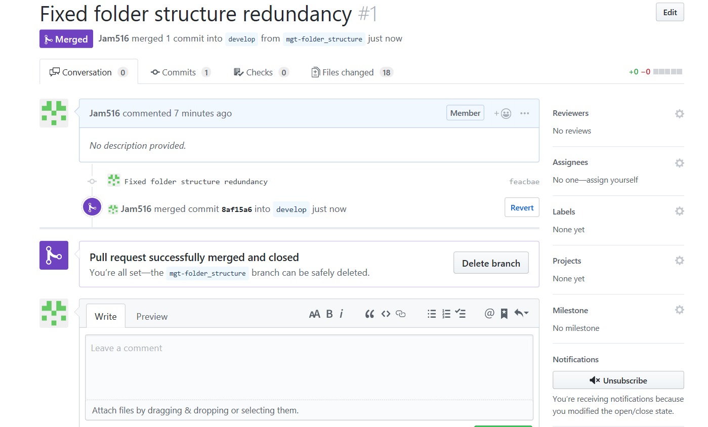

<p align="center">
  
</p>

This is the official repository of HYPED. HYPED is a student society at the University of Edinburgh dedicated to accelerating the development of Hyperloop and implementing the technology in the UK. HYPED is advancing both technical and commercial development of Hyperloop, having seen success in two international competitions. https://hyp-ed.com/

# Contributing

The following is a set of guidelines for contributing to HYPED. Use your best judgment, and feel free to propose changes to this document in a pull request.

## Coding Style

Since we will have dozens of developers coding for the pod, it is very important that everyone adheres to the same code style. For that purpose we have created the following [style guide](https://hyp-ed.github.io/styleguide/).

## Git

Git is a prerequisite for this project. If you have not attended any git workshop yet or are not permitted to code, please ask Brano for further instructions.

### Workflow

- For our project we are using the [Gitflow](http://nvie.com/posts/a-successful-git-branching-model/) workflow. 
- Two main branches are used to record the history of the project: develop and master
- Develop branch serves as an integration branch for features. To add a feature you branch of from    develop and when feature is complete you merge back into develop.
- Master holds release history. Features never directly interact with master.

### Adding a new feature

##### 1. Branching off
#
Start a new feature branch. Branch names should follow the convention abbreviation + purpose of feature

  ```sh
  git checkout develop
  git checkout -b <subteam-feature>
  git push -u origin <subteam-feature>
  ```

  ###### Standard abbreviations

  `mgt` - Management (Heads)  
   `stm` - State Machine  
   `nav` - Navigation  
   `tlm` - Telemetry  
   `lib` - Libraries  
   `mot` - Motor Control  
   `sns` - Sensors
   `tst` - Testing

##### 2. Build your feature
#  
(i) Checkout your feature branch.
  ```sh
  git checkout <subteam-feature>
  ```
 (ii) If other people are working on the feature pull their changes and thus avoid future conflicts

   ```sh
 git pull --rebase
   ```

(iii) If you have conflicts [resolve them](https://help.github.com/articles/resolving-a-merge-conflict-using-the-command-line/) and continue rebase. (Remember **not** to commit.)
  ```sh
  git add <file1> <file2> ...
  git rebase --continue
  ```
(iii) Make changes. 
>Always check status before and after adding to confirm that you have only made changes you intended to make. 
>When commiting changes use good commit messages: Start with an imperative verb .eg. **Add** function z, **Remove** deprecated method, **Refactor** system x, **Update** documentation


  ```sh
  git status
  git add
  git status
  git commit -m "commit"
  ```

(iv) Push your branch.
  ```sh
  git push origin <subteam-feature>
  ```
#
##### 4. Open a pull request
#  
* Every pull request requires at least one reveiwer
* This should ideally be somebody on your sub-team
* Reviewers should take the time to understand the code even if they trust the contributor. If there are flaws in the **functionality** and **style** DO NOT APPROVE. Request the necessary changes and approve once they have been pushed.

<p align="center">
  
</p>

<p align="center">
  
</p>

#
##### 3. Merge pull request
#  
* Once your feature branch has been approved by a reviewer it is youre responsibility to merge it into the develop branch.
* Remember to delete the branch once it has been merged in, both on the remote and local repo.

<p align="center">
  
</p>


