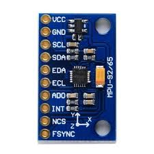
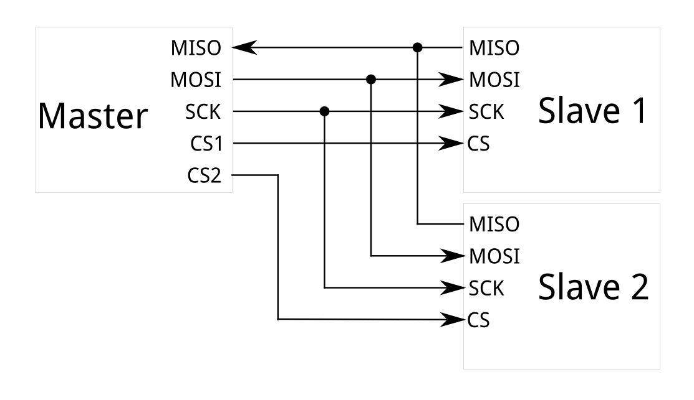

## BeagleBone Black Hardware

### BBB Pinout:

### Using SPI with the MPU9250:

MPU9250:

To use SPI to communicate with the MPU9250 we need to connect the BeagleBone as Master and the MPU9250 as Slave. Using the Diagram below as a reference we can wire them as follows:

| BeagleBone (P9 side)                | MPU9250 | Purpose                                      |
| ----------------------------------- | ------- | -------------------------------------------- |
| Pin 17 (SPI0_CS0) / Or any GPIO pin | NCS     | Chip select (Select slave for read or write) |
| Pin 18 (SPI0_D1)                    | SDA     | Write data to MPU                            |
| Pin 21 (SPI0_D0)                    | ADO     | Read data from MPU                           |
| Pin 22 (SPI0_SCLK)                  | SCL     | Clock                                        |
| Pin 03 or Pin 04 (+3.3V)            | VCC     | Voltage Source                               |
| Pin 01 or Pin 02 (DGND)             | GND     | Ground                                       |

Once wired correctly SPI should work as intended and the BeagleBone should be able to read and write from/to the MPU9250.

##### SPI Diagram for reference:

