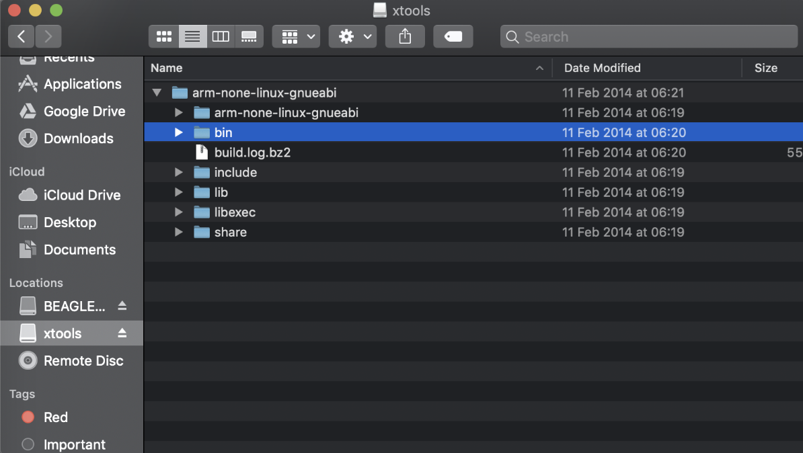
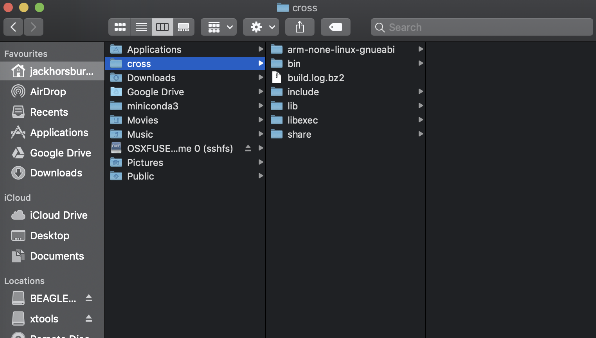
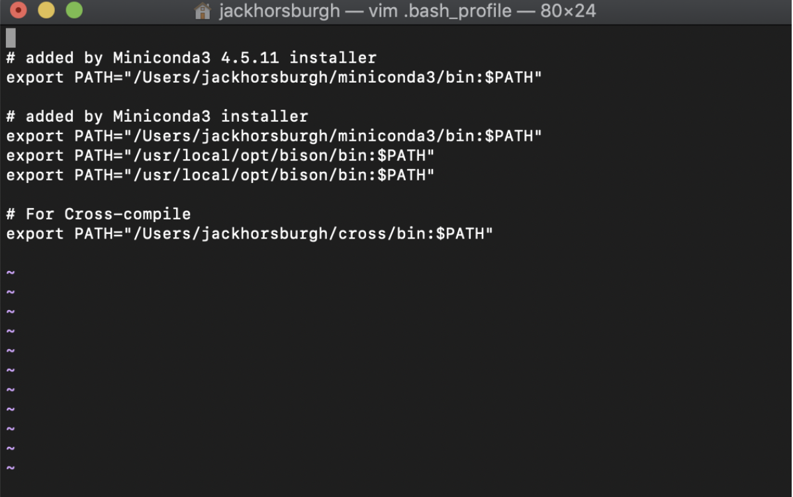

# Mac Cross Compile

1. Download the file called rpi-xtools-201402102110.dmg.zip [here](https://drive.google.com/open?id=1oeuyWpaTAT9d7mF3xYy6CzipoqZ-5uGS)
2. Unzip the file
3. Run the rpi-xtools-201402102110.dmg file
4. Your folder should look like this: 
5. You now need to copy the **first** file arm-none-linux-gnueabi to a folder on your computer to do this you will need to use the terminal and do the following:

Open up terminal and navigate to the file using:

````sh
cd /Volumes/xtools\ 1/
````

If this is not correct then you need to find the file path to the first occurrence of arm-none-linux-gnueabi.

Copy the files in the arm-none-linux-gnueabi to another location on your computer, for example I am copying it to “/Users/jackhorsburgh/cross”

The terminal command you need is:
````sh
sudo cp -rf /arm-none-linux-gnueabi /Users/jackhorsburgh/cross
````

Now you should see this:



6. Adding bin to environment path:

Navigate to your home directory, quick way is to use 
````terminal 
cd 
````

Run the command:

````sh
vim .bash_profile
````

You should see this:



Yours will be different, but add the line:

````sh
export PATH="/Users/jackhorsburgh/cross/bin:$PATH"
````

Where /Users/jackhorsburgh/cross can be replaced with the location you copied the arm-none-linux-gnueabi to.

## Create symbolic link to keep compilers consisten
```
cd /Users/jackhorsburgh/cross/bin
ln -s arm-none-linux-gnueabi-g++ hyped-cross-g++
```

Woooo! Cross-compile should be set-up. We need to test if it works.

## Testing Cross Compile

Reload your terminal/Open a new terminal

[BBB] Create a hello world program.

[MAC] Mount the BBB to your mac.

[MAC] Go to where the hello world program was created on the BBB.

[MAC] Run the command:
arm-none-linux-gnueabi-c++ hello.cpp

Where hello.cpp will be whatever you called your hello world program

[BBB] Run the compiled hello world program.

[MAC] to cross-compile run:
````sh
make CROSS=1
````
